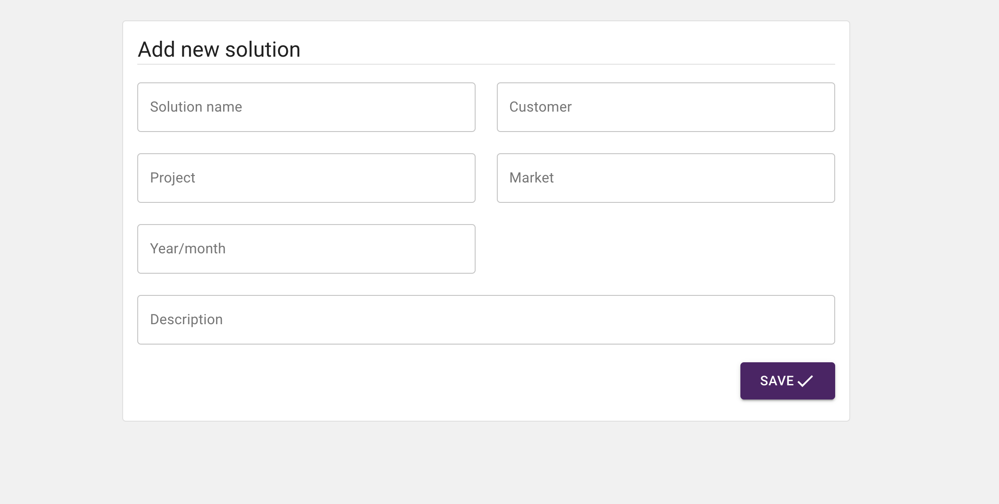
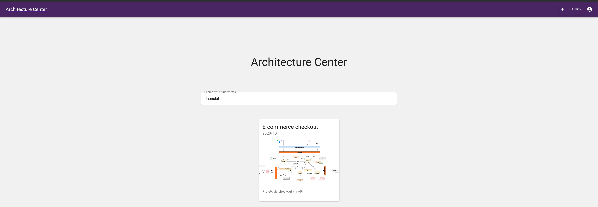
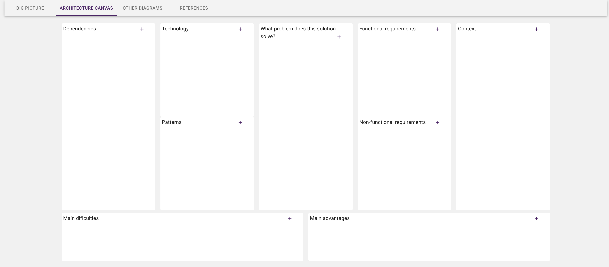

# Architecture center front-end

Open source tool to be a knowledge base for architectural solutions.

**Made with**
* ReactJs
* NextJs
* Apollo GrapghQl
* Material UI

## How to use


#### For development

```sh
yarn

yarn dev
```

#### For production
Buid and run it:

```sh
yarn build
yarn start
```

## Features

* Add new solutions
* Search of the sollutions
* Solution details
* **Architecture Canvas** - Visual tool to give a shared vision of architectural solutions

### Add new solutions



### Search of the soluttions



### Architecture Canvas

